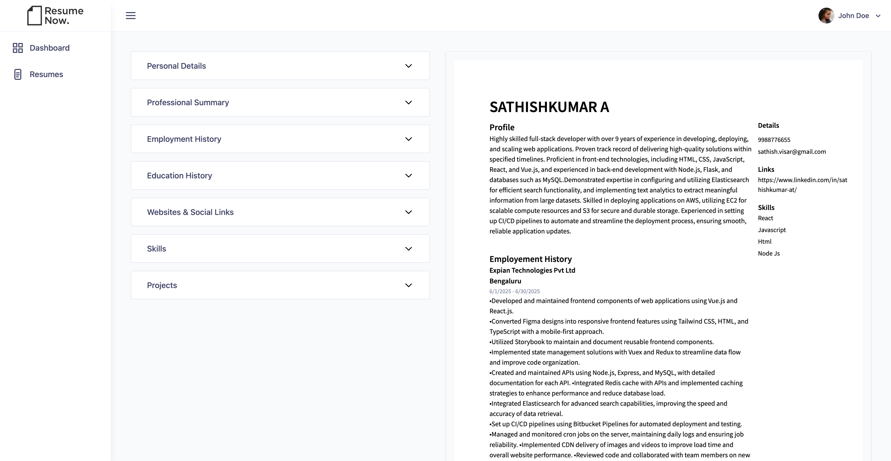
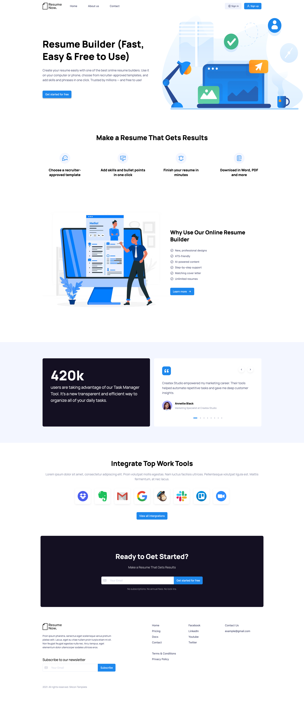

# 📝 Online Resume Builder

A full-stack web application for creating professional resumes online — inspired by [resume.io](https://resume.io). Users can easily build, edit, and preview resumes in real time with downloadable PDF support.

This project was built as a personal practice project using modern frontend and backend technologies.

---

## 🚀 Features

- ⚡ Real-time resume updates using WebSockets (Socket.io)
- 🎨 Pre-designed resume templates with Tailwind CSS
- 🧠 Global state management with Redux
- 📝 Editable sections: Personal Info, Work Experience, Education, Skills, Projects, etc.
- 📄 Live preview of the resume as you type
- 📥 Download resume as PDF
- 🔐 (Optional) Authentication for saving and managing resumes
- 🔐 Authentication:
    ✅ Implemented Google Login & Register
    ✅ User Login & Register with Email & Password

---

## 🧰 Tech Stack

### Frontend
- **React.js**
- **Redux Toolkit**
- **Tailwind CSS**
- **Socket.io-client**

### Backend
- **Node.js**
- **Express.js**
- **TypeScript**
- **MongoDB** (with Mongoose)
- **Socket.io**

### 📸 Preview

